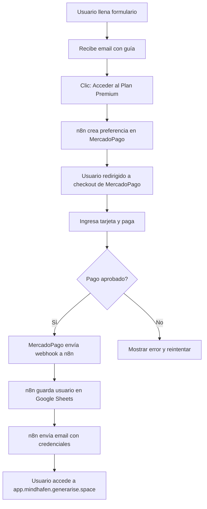

# 💳 INTEGRACIÓN MERCADOPAGO - GUÍA COMPLETA

## 🎯 QUÉ HACE ESTE WORKFLOW

```
Usuario registrado → Clic "Pagar" → MercadoPago → Pago exitoso → Email con acceso
```

**2 Webhooks:**
1. **Crear pago:** Usuario solicita pagar → Genera link de MercadoPago
2. **Confirmar pago:** MercadoPago notifica pago → Envía email con credenciales

---

## 📋 CONFIGURACIÓN EN 4 PASOS

### PASO 1: Configurar Webhooks en MercadoPago (5 min)

1. **Ir a MercadoPago:**
   ```
   https://www.mercadopago.com.ar/developers/panel
   ```

2. **Ir a "Webhooks":**
   ```
   En el menú lateral: Tus integraciones → Webhooks
   ```

3. **Crear Nuevo Webhook:**
   ```
   URL de notificación:
   https://manager.generarise.space/webhook/mercadopago-notification
   
   Eventos a notificar:
   ✅ payment.created
   ✅ payment.updated
   
   Clic: "Guardar"
   ```

4. **Copiar tu clave:**
   ```
   Ya tienes:
   ✅ Public Key: APP_USR-6088fe58-e15d-44d4-af7b-e4d09eb9030f
   ✅ Access Token: APP_USR-2662030501407901-070617-26cd9e8e4a1f61917e341886b260864c-89801872
   ```

---

### PASO 2: Importar Workflow en n8n (2 min)

1. **Ir a n8n:**
   ```
   https://manager.generarise.space
   ```

2. **Importar:**
   ```
   Workflows → Import from File
   Seleccionar: n8n_mercadopago_complete.json
   Clic: "Import"
   ```

3. **Activar:**
   ```
   Toggle "Active" → Verde ✅
   ```

---

### PASO 3: Configurar Credenciales (5 min)

El workflow tiene 2 nodos que necesitan configuración:

#### A) Google Sheets (para guardar usuarios)
```
1. Crear Sheet en Google:
   Nombre: "MindHafen Pagos"
   Columnas: Timestamp | Name | Email | Goal | Payment_ID | Amount | Status | Payment_Method

2. Copiar Sheet ID de la URL:
   https://docs.google.com/spreadsheets/d/ESTE_ES_EL_ID/edit
   
3. En n8n, nodo "Guardar en Google Sheets":
   - Credentials → Create New → Google Sheets OAuth2
   - Autorizar tu cuenta
   - Document ID: Pegar el ID copiado
```

#### B) SMTP (para enviar emails)
```
Usar Gmail o Brevo:

Gmail:
- SMTP: smtp.gmail.com
- Port: 587
- User: tu-email@gmail.com
- Password: [App Password de Google]

Brevo (recomendado):
- SMTP: smtp-relay.brevo.com
- Port: 587
- User: tu-email@example.com
- Password: [SMTP Key de Brevo]
```

---

### PASO 4: Modificar el HTML del Formulario (5 min)

Actualiza el formulario en `index.html` para que al enviar, muestre el botón de pago:

**Reemplazar en `script.js` (línea ~90):**

```javascript
// ANTES:
if (response.ok) {
    Swal.fire({
        title: '¡Bienvenido a MindHafen!',
        text: 'Tu guía está en camino a tu correo...',
        icon: 'success'
    });
}

// DESPUÉS:
if (response.ok) {
    const result = await response.json();
    
    Swal.fire({
        title: '¡Registro Exitoso!',
        html: `
            <p>Gracias por unirte, <strong>${data.name}</strong>.</p>
            <p>Te enviamos la guía gratuita a: <strong>${data.email}</strong></p>
            <hr>
            <h3>🎯 ¿Listo para el Programa Completo?</h3>
            <p><strong>Plan Premium:</strong> 12 módulos + IA 24/7</p>
            <p><strong>Precio:</strong> $29,999 ARS/mes</p>
            <button id="btnPagar" style="
                background: linear-gradient(90deg, #3b82f6, #2563eb);
                color: white;
                padding: 16px 32px;
                border: none;
                border-radius: 50px;
                font-size: 18px;
                cursor: pointer;
                margin-top: 15px;
            ">Acceder al Plan Premium →</button>
        `,
        icon: 'success',
        showConfirmButton: false,
        didOpen: () => {
            document.getElementById('btnPagar').addEventListener('click', async () => {
                Swal.showLoading();
                
                // Crear preferencia de pago en MercadoPago
                const paymentResponse = await fetch('https://manager.generarise.space/webhook/mindhafen-checkout', {
                    method: 'POST',
                    headers: { 'Content-Type': 'application/json' },
                    body: JSON.stringify({
                        name: data.name,
                        email: data.email,
                        goal: data.goal
                    })
                });
                
                const paymentData = await paymentResponse.json();
                
                if (paymentData.success) {
                    // Redirigir a MercadoPago
                    window.location.href = paymentData.checkout_url;
                } else {
                    Swal.fire('Error', 'No se pudo crear el pago', 'error');
                }
            });
        }
    });
}
```

---

## 🧪 PROBAR LA INTEGRACIÓN

### Test 1: Crear Preferencia de Pago
```powershell
$body = '{"name":"Test User","email":"test@example.com","goal":"stress_reduction"}'

Invoke-RestMethod `
    -Uri "https://manager.generarise.space/webhook/mindhafen-checkout" `
    -Method POST `
    -ContentType "application/json" `
    -Body $body
```

**Resultado esperado:**
```json
{
  "success": true,
  "checkout_url": "https://www.mercadopago.com.ar/checkout/v1/redirect?pref_id=XXX",
  "preference_id": "89801872-XXXX-XXXX"
}
```

### Test 2: Probar Pago Real (Sandbox)
```
1. Abrir el checkout_url en el navegador
2. Usar tarjeta de prueba de MercadoPago:
   Número: 5031 7557 3453 0604
   CVV: 123
   Fecha: 11/25
   Nombre: APRO (aprueba)

3. Completar pago
4. Verificar:
   - Email recibido ✅
   - Usuario en Google Sheet ✅
   - Webhook ejecutado en n8n ✅
```

**Tarjetas de prueba de MercadoPago:**
```
Aprobar: 5031 7557 3453 0604 (APRO)
Rechazar: 5031 4332 1540 6351 (OTHE)
Pendiente: 5031 7557 3453 0604 (Nombre: CONT)
```

Más tarjetas: https://www.mercadopago.com.ar/developers/es/docs/checkout-pro/additional-content/test-cards

---

## 📊 PRECIOS CONFIGURADOS

**En el workflow está configurado:**
```javascript
"unit_price": 29999  // $29,999 ARS (~$29 USD al cambio)
```

**Para cambiar el precio:**
```
1. Ir a n8n → Abrir workflow
2. Clic en nodo "MercadoPago - Crear Preferencia"
3. Buscar línea: "unit_price": 29999
4. Cambiar a tu precio deseado (en pesos argentinos, SIN decimales)
5. Save
```

**Precios sugeridos:**
```
Mensual: 29,999 ARS
Trimestral: 69,999 ARS (ahorro 20%)
Anual: 249,999 ARS (ahorro 30%)
```

---

## 🔄 FLUJO COMPLETO EXPLICADO



---

## 🎨 PÁGINAS DE RETORNO

Crear 3 páginas HTML simples en `/code/mindhafen/`:

### success.html
```html
<!DOCTYPE html>
<html>
<head>
    <title>¡Pago Exitoso!</title>
    <style>
        body { font-family: Arial; text-align: center; padding: 50px; background: #10b981; color: white; }
        h1 { font-size: 48px; }
    </style>
</head>
<body>
    <h1>✅ ¡Pago Exitoso!</h1>
    <p>Tu pago se procesó correctamente.</p>
    <p>En 1 minuto recibirás un email con tus credenciales de acceso.</p>
    <a href="https://mindhafen.generarise.space" style="color: white; font-size: 20px;">Volver al inicio</a>
</body>
</html>
```

### failure.html
```html
<!DOCTYPE html>
<html>
<head>
    <title>Pago Rechazado</title>
    <style>
        body { font-family: Arial; text-align: center; padding: 50px; background: #ef4444; color: white; }
        h1 { font-size: 48px; }
    </style>
</head>
<body>
    <h1>❌ Pago Rechazado</h1>
    <p>Hubo un problema con tu pago.</p>
    <p>Por favor intenta nuevamente o contacta a soporte.</p>
    <a href="https://mindhafen.generarise.space" style="color: white; font-size: 20px;">Volver al inicio</a>
</body>
</html>
```

### pending.html
```html
<!DOCTYPE html>
<html>
<head>
    <title>Pago Pendiente</title>
    <style>
        body { font-family: Arial; text-align: center; padding: 50px; background: #f59e0b; color: white; }
        h1 { font-size: 48px; }
    </style>
</head>
<body>
    <h1>⏳ Pago Pendiente</h1>
    <p>Tu pago está siendo procesado.</p>
    <p>Te notificaremos por email cuando se confirme.</p>
    <a href="https://mindhafen.generarise.space" style="color: white; font-size: 20px;">Volver al inicio</a>
</body>
</html>
```

---

## ✅ CHECKLIST FINAL

- [ ] Configuré webhook en MercadoPago
- [ ] Importé workflow en n8n
- [ ] Activé el workflow (toggle verde)
- [ ] Configuré Google Sheets credentials
- [ ] Configuré SMTP credentials
- [ ] Actualicé script.js con botón de pago
- [ ] Creé páginas success/failure/pending.html
- [ ] Probé con tarjeta de prueba
- [ ] Recibí email de bienvenida
- [ ] Usuario guardado en Google Sheet

---

**Tiempo estimado:** 30 minutos

**Próximo paso:** Crear el dashboard (app.mindhafen.generarise.space)
