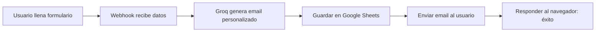

# 🚀 Configuración del Workflow n8n - MindHafen

## 📋 PASO A PASO

### 1. Crear Google Sheet para Contactos

**1.1. Crear el Sheet:**
```
1. Ve a https://sheets.google.com
2. Crear → Hoja de cálculo en blanco
3. Nombre: "MindHafen Leads"
```

**1.2. Configurar columnas (Fila 1):**
```
A1: Timestamp
B1: Name
C1: Email
D1: Goal
E1: Source
F1: Status
```

**1.3. Copiar el ID del Sheet:**
```
URL: https://docs.google.com/spreadsheets/d/ESTE_ES_EL_ID/edit
                                            ^^^^^^^^^^^^
Ejemplo: 1a2b3c4d5e6f7g8h9i0j
```

---

### 2. Importar Workflow a n8n

**2.1. Acceder a n8n:**
```
URL: https://manager.generarise.space
```

**2.2. Importar archivo:**
```
1. Workflows → "Import from File"
2. Seleccionar: n8n_workflow_PRODUCTION_v2.json
3. Clic en "Import"
```

---

### 3. Configurar Credenciales

#### 3.1. Groq API

**Obtener API Key:**
```
1. Ve a https://console.groq.com
2. API Keys → Create API Key
3. Copiar la key (empieza con gsk_...)
```

**En n8n:**
```
1. Clic en nodo "Groq Chat Model"
2. Credentials → Create New
3. Credential Type: Groq API
4. Pegar API Key
5. Save
```

#### 3.2. Google Sheets

**En n8n:**
```
1. Clic en nodo "Save to Google Sheets"
2. Credentials → Create New
3. Credential Type: Google Sheets OAuth2 API
4. Clic en "Sign in with Google"
5. Autorizar acceso
6. Seleccionar tu Sheet: "MindHafen Leads"
7. Save
```

#### 3.3. Email (SMTP)

**Opción A - Gmail (Gratis):**
```
SMTP Host: smtp.gmail.com
Port: 587
User: tu-email@gmail.com
Password: [App Password - Ver nota abajo]
```

**Opción B - Brevo (Recomendado):**
```
SMTP Host: smtp-relay.brevo.com
Port: 587
User: tu-email@example.com
Password: [SMTP Key de Brevo]
```

**Nota Gmail App Password:**
```
1. Gmail → Configuración → Seguridad
2. Verificación en 2 pasos (activar)
3. Contraseñas de aplicaciones
4. Generar contraseña para "n8n"
```

**En n8n:**
```
1. Clic en nodo "Send Email"
2. Credentials → Create New
3. Credential Type: SMTP
4. Completar datos según tu proveedor
5. Save
```

---

### 4. Configurar IDs en el Workflow

**4.1. Google Sheet ID:**
```
1. Clic en nodo "Save to Google Sheets"
2. En "Document ID" → Pegar el ID copiado en Paso 1.3
3. Sheet Name: "Sheet1" (o el nombre de tu hoja)
```

**4.2. Email "From":**
```
1. Clic en nodo "Send Email"
2. From Email: cambiar a tu email real
   Ejemplo: noreply@generarise.space
   O: contacto@mindhafen.com
```

---

### 5. Activar el Workflow

```
1. En la esquina superior derecha → Toggle "Active"
2. Verificar que diga "Active" en verde
3. El workflow ahora está ejecutándose 24/7
```

---

### 6. Probar el Workflow

**6.1. Desde PowerShell:**
```powershell
$body = @{
    name = "Juan Pérez"
    email = "tu-email-real@gmail.com"
    goal = "stress_reduction"
    source = "mindhafen_mvp_landing"
} | ConvertTo-Json

Invoke-RestMethod -Uri "https://manager.generarise.space/webhook/8f7cbf0e-4ac0-4660-a524-9af706728a52" `
    -Method POST `
    -ContentType "application/json" `
    -Body $body
```

**6.2. Verificar resultados:**
```
✅ Gmail/Outlook: Debería llegar un email
✅ Google Sheet: Debería aparecer una nueva fila
✅ n8n: Ver "Executions" → Última ejecución con éxito
```

---

## 📊 FLUJO COMPLETO



---

## 🎯 PROMPT DE GROQ EXPLICADO

### Características del Prompt:

1. **Personalización:**
   - Usa el nombre del usuario
   - Adapta el contenido según su objetivo (estrés, enfoque, sueño, ansiedad)

2. **Estructura Científica:**
   - Incluye un mini-consejo basado en neurociencia
   - Mantiene tono profesional pero cercano

3. **Limitaciones Anti-Error:**
   - Máximo 150 palabras (para no exceder límites de email)
   - Formato texto plano (evita errores de HTML)
   - No genera JSON (evita confusión del modelo)

4. **Mapeo de Objetivos:**
   ```
   stress_reduction → Técnicas de descompresión neuronal
   focus            → Mejora de concentración ejecutiva
   sleep            → Higiene del sueño y ritmos circadianos
   anxiety          → Regulación del sistema nervioso
   ```

---

## 🔧 PERSONALIZAR EL PROMPT

Si quieres cambiar el tono o contenido:

### Abrir el nodo "AI Agent - Email Generator"
```
1. Clic en el nodo
2. Options → System Message
3. Editar el texto
4. Save
```

### Ejemplos de Variaciones:

**Más científico:**
```
Incluye referencias a estudios de neuroplasticidad y regulación del eje HPA (hipotálamo-pituitaria-adrenal)...
```

**Más casual:**
```
Tono: Habla como un amigo experto en salud mental, usa ejemplos cotidianos y evita jerga científica...
```

**Más corto:**
```
Máximo 80 palabras. Ir directo al punto: saludo, objetivo, guía, despedida.
```

---

## 📧 EJEMPLO DE EMAIL GENERADO

**Input del usuario:**
```json
{
  "name": "María González",
  "email": "maria@example.com",
  "goal": "anxiety"
}
```

**Email generado por Groq:**
```
Hola María,

Gracias por unirte a MindHafen. Entiendo que tu objetivo principal es controlar la ansiedad, y quiero que sepas que has dado el primer paso más importante: decidir tomar acción.

La ansiedad surge cuando tu sistema nervioso entra en modo "alerta constante". La buena noticia es que con ejercicios de regulación vagal (respiración consciente y movimientos suaves), puedes entrenar tu cerebro para volver al estado de calma natural.

En los próximos minutos recibirás nuestra Guía de Descompresión Neuronal en tu bandeja de entrada. Es un documento práctico diseñado para que empieces hoy mismo.

Estamos aquí para acompañarte en este proceso.

Con compromiso científico,
Equipo MindHafen
```

---

## 🚨 TROUBLESHOOTING

### Email no llega:
```
1. Verificar credenciales SMTP están correctas
2. Revisar spam/correo no deseado
3. Verificar límites de envío (Gmail = 500/día)
```

### Google Sheets no guarda:
```
1. Verificar permisos de la cuenta de Google
2. Confirmar que el Sheet ID es correcto
3. Revisar que las columnas coincidan exactamente
```

### Groq devuelve error:
```
1. Verificar API Key es válida
2. Confirmar que el modelo "llama-3.3-70b-versatile" existe
3. Revisar límites de rate (gratis = 30 req/min)
```

---

## ✅ CHECKLIST FINAL

- [ ] Google Sheet creado con columnas correctas
- [ ] Workflow importado a n8n
- [ ] Credencial Groq configurada
- [ ] Credencial Google Sheets configurada
- [ ] Credencial SMTP configurada
- [ ] Sheet ID actualizado en el nodo
- [ ] Email "From" actualizado
- [ ] Workflow activado (toggle verde)
- [ ] Test con PowerShell exitoso
- [ ] Email recibido en bandeja
- [ ] Datos guardados en Sheet

---

**Última actualización:** 2026-01-24  
**Versión del Workflow:** v2 (Production)
